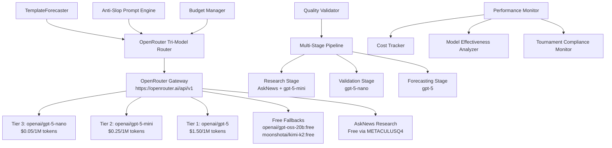

# Design Document - OpenRouter Tri-Model Optimization with Anti-Slop Directives

## Overview

This design document outlines the architecture for an enhanced OpenRouter tri-model system that implements strategic cost-performance optimization with sophisticated anti-slop quality guards. The system will maximize tournament forecasting performance within the $100 budget constraint by intelligently routing tasks across OpenRouter's available models while ensuring evidence-based reasoning and tournament compliance through a unified API gateway approach.

## Architecture

### High-Level Architecture



### Strategic Cost-Performance Triangle via OpenRouter

The system implements a three-tier model hierarchy optimized for different cognitive loads through OpenRouter's unified gateway:

1. **Tier 3: openai/gpt-5-nano** ($0.05/1M tokens)
   - Ultra-fast validation and parsing
   - Simple summaries and basic fact-checking
   - Deterministic responses (temp=0.1)
   - 30-second timeout for speed

2. **Tier 2: openai/gpt-5-mini** ($0.25/1M tokens)
   - Research synthesis and intermediate reasoning
   - News summarization and moderate complexity analysis
   - Balanced creativity (temp=0.3)
   - 60-second timeout for thoroughness

3. **Tier 1: openai/gpt-5** ($1.50/1M tokens)
   - Final forecasting decisions and complex analysis
   - Maximum reasoning power for critical predictions
   - Precise calibration (temp=0.0)
   - 90-second timeout for deep thinking

4. **Free Fallbacks** ($0/1M tokens)
   - openai/gpt-oss-20b:free for emergency operation
   - moonshotai/kimi-k2:free for budget exhaustion
   - Essential functionality preservation

5. **Cost-Optimized Research Strategy** (AskNews Primary)
   - **Primary**: AskNews API (100% FREE for 4 months via METACULUSQ4 tournament code)
   - **Synthesis**: openai/gpt-5-mini for analysis and citation formatting
   - **Fallback**: openai/gpt-oss-20b:free and moonshotai/kimi-k2:free when AskNews quota exhausted
   - **NO expensive APIs**: Perplexity, Claude, or other paid research services eliminated
   - Real-time 48-hour news focus with cost optimization

## Components and Interfaces

### OpenRouter Tri-Model Router

```python
class OpenRouterTriModelRouter:
    """
    Strategic model routing through OpenRouter with advanced decision logic.
    """

    def __init__(self):
        self.openrouter_base_url = "https://openrouter.ai/api/v1"
        self.openrouter_headers = self._get_attribution_headers()
        self.models: Dict[ModelTier, OpenRouterModel]
        self.routing_strategy: Dict[TaskType, ModelTier]
        self.cost_tracker: CostTracker
        self.performance_analyzer: ModelPerformanceAnalyzer

    def _get_attribution_headers(self) -> Dict[str, str]:
        """Get OpenRouter attribution headers for ranking."""
        return {
            "HTTP-Referer": os.getenv("OPENROUTER_HTTP_REFERER"),
            "X-Title": os.getenv("OPENROUTER_APP_TITLE")
        }

    async def route_query(
        self,
        task_type: TaskType,
        content: str,
        complexity: ComplexityLevel,
        budget_remaining: float,
        priority: TaskPriority = "normal"
    ) -> RoutingResult:
        """Route query through OpenRouter with enhanced decision logic."""

    def choose_optimal_model(
        self,
        task_type: TaskType,
        complexity: ComplexityLevel,
        content_analysis: ContentAnalysis,
        budget_context: BudgetContext
    ) -> OpenRouterModelSelection:
        """Advanced model selection with OpenRouter provider routing."""

    def _create_provider_preferences(
        self,
        model_name: str,
        budget_mode: BudgetMode
    ) -> Dict[str, Any]:
        """Create OpenRouter provider preferences for optimal routing."""
        preferences = {}
        if budget_mode == BudgetMode.CRITICAL:
            preferences["sort"] = "price"  # Use :floor shortcut equivalent
        elif budget_mode == BudgetMode.EMERGENCY:
            preferences["max_price"] = {"prompt": 0.1, "completion": 0.1}
        return preferences

    def get_routing_explanation(self, selection: OpenRouterModelSelection) -> str:
        """Provide transparent reasoning for model choice."""
```

### Advanced Anti-Slop Prompt Engine

```python
class AdvancedAntiSlopPrompts:
    """
    State-of-the-art prompt engineering with quality guards.
    """

    def create_research_prompt(
        self,
        question: MetaculusQuestion,
        model_tier: ModelTier,
        context: ResearchContext
    ) -> EnhancedPrompt:
        """Create tier-optimized research prompt with anti-slop directives."""

    def create_forecasting_prompt(
        self,
        question: MetaculusQuestion,
        research: ResearchResults,
        model_tier: ModelTier,
        calibration_context: CalibrationContext
    ) -> EnhancedPrompt:
        """Create forecasting prompt with advanced calibration techniques."""

    def create_validation_prompt(
        self,
        content: str,
        task_type: TaskType,
        quality_criteria: QualityCriteria
    ) -> ValidationPrompt:
        """Create validation prompt for quality assurance."""
```

### Multi-Stage Validation Pipeline

```python
class MultiStageValidationPipeline:
    """
    Three-stage validation system for quality assurance via OpenRouter.
    """

    async def execute_research_stage(
        self,
        question: MetaculusQuestion
    ) -> ValidatedResearch:
        """Stage 1: Cost-optimized research with AskNews (FREE) + gpt-5-mini synthesis."""
        # PRIMARY: AskNews API for research (100% FREE for 4 months via METACULUSQ4)
        # SYNTHESIS: openai/gpt-5-mini for analysis and citation formatting
        # FALLBACK: openai/gpt-oss-20b:free or moonshotai/kimi-k2:free when AskNews quota exhausted
        # NO EXPENSIVE APIS: Perplexity, Claude, or other paid research services

    async def execute_validation_stage(
        self,
        research: ResearchResults
    ) -> ValidationResults:
        """Stage 2: Validation with gpt-5-nano + hallucination detection."""
        # Use openai/gpt-5-nano for fast validation
        # Check citations, logical consistency, evidence traceability

    async def execute_forecasting_stage(
        self,
        question: MetaculusQuestion,
        validated_research: ValidatedResearch
    ) -> CalibratedForecast:
        """Stage 3: Forecasting with gpt-5 + calibration checks."""
        # Use openai/gpt-5 for maximum reasoning power
        # Apply calibration techniques and uncertainty quantification
```

### OpenRouter Configuration Manager

```python
class OpenRouterConfigManager:
    """
    Manages OpenRouter-specific configuration and provider routing.
    """

    def __init__(self):
        self.base_url = "https://openrouter.ai/api/v1"
        self.api_key = os.getenv("OPENROUTER_API_KEY")
        self.attribution_headers = self._get_attribution_headers()

    def _get_attribution_headers(self) -> Dict[str, str]:
        """Get attribution headers for OpenRouter ranking."""
        headers = {}
        if referer := os.getenv("OPENROUTER_HTTP_REFERER"):
            headers["HTTP-Referer"] = referer
        if title := os.getenv("OPENROUTER_APP_TITLE"):
            headers["X-Title"] = title
        return headers

    def create_model_client(
        self,
        model_name: str,
        provider_preferences: Optional[Dict[str, Any]] = None
    ) -> GeneralLlm:
        """Create OpenRouter-configured model client."""
        return GeneralLlm(
            model=model_name,
            api_key=self.api_key,
            base_url=self.base_url,
            extra_headers=self.attribution_headers,
            provider_preferences=provider_preferences
        )

    def get_provider_preferences_for_budget_mode(
        self,
        budget_mode: BudgetMode
    ) -> Dict[str, Any]:
        """Get provider preferences optimized for budget mode."""
        if budget_mode == BudgetMode.CRITICAL:
            return {
                "sort": "price",
                "allow_fallbacks": True,
                "only": ["openai", "moonshotai"]  # Free models only
            }
        elif budget_mode == BudgetMode.EMERGENCY:
            return {
                "sort": "price",
                "max_price": {"prompt": 0.1, "completion": 0.1}
            }
        return {"sort": "price"}  # Default to price optimization

### Budget-Aware Operation Manager

```python
class BudgetAwareOperationManager:
    """
    Dynamic operation mode management based on budget utilization.
    """

    def get_current_operation_mode(self, budget_status: BudgetStatus) -> OperationMode:
        """Determine current operation mode based on budget."""

    def adjust_routing_strategy(
        self,
        mode: OperationMode,
        base_strategy: RoutingStrategy
    ) -> AdjustedStrategy:
        """Adjust model routing based on operation mode."""

    def get_emergency_protocols(self) -> EmergencyProtocols:
        """Define emergency protocols for budget exhaustion."""
        return EmergencyProtocols(
            free_models=["openai/gpt-oss-20b:free", "moonshotai/kimi-k2:free"],
            essential_functions_only=True,
            max_tokens_per_request=500
        )
```

## Data Models

### Enhanced Routing Models

```python
@dataclass
class ContentAnalysis:
    length: int
    complexity_score: float
    domain: str
    urgency: TaskUrgency
    estimated_tokens: int

@dataclass
class BudgetContext:
    remaining_percentage: float
    estimated_questions_remaining: int
    current_burn_rate: float
    operation_mode: OperationMode

@dataclass
class OpenRouterModelSelection:
    selected_model: str  # e.g., "openai/gpt-4o-mini"
    selected_tier: ModelTier
    rationale: str
    estimated_cost: float
    confidence_score: float
    provider_preferences: Dict[str, Any]
    fallback_models: List[str]

@dataclass
class RoutingResult:
    response: str
    model_used: ModelTier
    actual_cost: float
    performance_metrics: PerformanceMetrics
    quality_score: float
```

### Quality Assurance Models

```python
@dataclass
class QualityMetrics:
    citation_compliance: float
    uncertainty_acknowledgment: bool
    evidence_traceability: float
    logical_consistency: float
    calibration_score: float

@dataclass
class ValidationResults:
    is_valid: bool
    quality_metrics: QualityMetrics
    identified_issues: List[QualityIssue]
    improvement_suggestions: List[str]
    confidence_level: float
```

## Error Handling

### Graceful Degradation Strategy

1. **Model Unavailability**
   - GPT-5 Full → GPT-5 Mini → GPT-5 Nano → GPT-4o fallback
   - Automatic retry with lower-tier models
   - Performance impact logging and alerting

2. **Budget Exhaustion**
   - Immediate switch to GPT-5 Nano only
   - Task prioritization based on tournament value
   - Graceful shutdown with status reporting

3. **API Failures**
   - Intelligent retry with exponential backoff
   - Cross-provider fallback (OpenRouter → Metaculus Proxy)
   - Emergency mode activation after threshold failures

4. **Quality Validation Failures**
   - Automatic prompt revision and retry
   - Fallback to simpler prompt templates
   - Human-readable error reporting

### Error Recovery Mechanisms

```python
class ErrorRecoveryManager:
    """
    Comprehensive error recovery for tournament reliability.
    """

    async def handle_model_failure(
        self,
        error: ModelError,
        context: TaskContext
    ) -> RecoveryAction:
        """Handle model-specific failures with intelligent fallbacks."""

    async def handle_budget_exhaustion(
        self,
        budget_status: BudgetStatus
    ) -> EmergencyResponse:
        """Handle budget exhaustion with graceful degradation."""

    async def handle_quality_failure(
        self,
        quality_issue: QualityIssue,
        original_prompt: str
    ) -> RevisedPrompt:
        """Handle quality validation failures with prompt revision."""
```

## Testing Strategy

### Unit Testing

1. **Model Router Testing**
   - Test model selection logic across all scenarios
   - Validate cost estimation accuracy
   - Test fallback mechanisms and error handling

2. **Prompt Engine Testing**
   - Validate anti-slop directive integration
   - Test tier-specific optimizations
   - Verify quality guard effectiveness

3. **Validation Pipeline Testing**
   - Test multi-stage validation workflow
   - Validate quality metrics calculation
   - Test error detection and recovery

### Integration Testing

1. **End-to-End Workflow Testing**
   - Complete question processing pipeline
   - Budget-aware operation mode switching
   - Tournament compliance validation

2. **Performance Testing**
   - Cost-effectiveness measurement
   - Response time optimization
   - Throughput under different operation modes

3. **Stress Testing**
   - Budget exhaustion scenarios
   - High-volume question processing
   - API failure recovery testing

### Tournament Simulation Testing

1. **Budget Simulation**
   - Full tournament budget utilization modeling
   - Cost optimization validation
   - Emergency mode effectiveness testing

2. **Quality Assurance Testing**
   - Anti-slop directive effectiveness
   - Citation compliance validation
   - Calibration accuracy measurement

3. **Compliance Testing**
   - Tournament rule adherence validation
   - Automated operation verification
   - Transparency requirement compliance

## Performance Optimization

### Model Selection Optimization

1. **Dynamic Complexity Assessment**
   - Real-time question complexity analysis
   - Historical performance-based adjustments
   - Context-aware difficulty scoring

2. **Cost-Performance Modeling**
   - Continuous cost-effectiveness tracking
   - Model performance correlation analysis
   - ROI optimization for tournament scoring

3. **Adaptive Routing Strategies**
   - Learning from historical routing decisions
   - Performance-based strategy refinement
   - Tournament phase-aware adjustments

### Prompt Engineering Optimization

1. **Token Efficiency Optimization**
   - Prompt length minimization techniques
   - Context compression strategies
   - Output format optimization

2. **Quality-Cost Balance**
   - Minimum viable prompt complexity
   - Quality threshold optimization
   - Cost-aware prompt selection

3. **Tier-Specific Optimization**
   - Model capability-matched prompts
   - Tier-specific instruction optimization
   - Performance ceiling maximization

## Monitoring and Analytics

### Real-Time Monitoring

1. **Cost Tracking Dashboard**
   - Live budget utilization monitoring
   - Cost per question breakdown
   - Projected tournament total

2. **Performance Metrics Dashboard**
   - Model selection effectiveness
   - Quality score trends
   - Tournament competitiveness indicators

3. **System Health Monitoring**
   - API availability and response times
   - Error rates and recovery success
   - Operation mode transitions

### Analytics and Insights

1. **Cost Optimization Analytics**
   - Model tier ROI analysis
   - Budget allocation effectiveness
   - Cost reduction opportunity identification

2. **Quality Analytics**
   - Anti-slop directive effectiveness
   - Citation compliance trends
   - Calibration improvement tracking

3. **Tournament Performance Analytics**
   - Competitive positioning analysis
   - Forecast accuracy vs. cost correlation
   - Strategic adjustment recommendations

This design provides a comprehensive framework for implementing the enhanced GPT-5 tri-model system with sophisticated anti-slop directives, ensuring optimal tournament performance within budget constraints while maintaining the highest quality standards.
