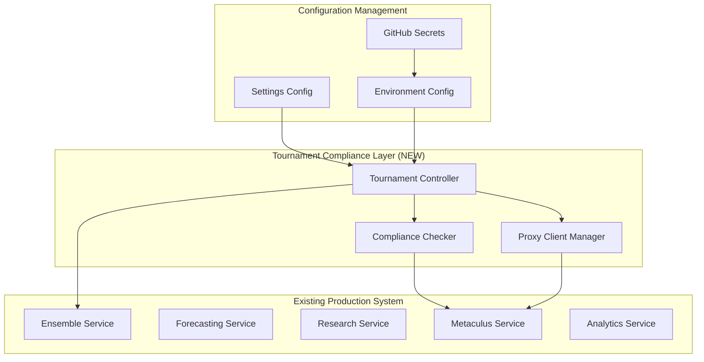

# Design Document - Production AI Forecasting Bot Tournament Compliance

## Overview

This design document outlines the tournament compliance fixes needed for the existing sophisticated AI forecasting bot system to participate in the Metaculus Fall 2025 AI Forecasting Benchmark Tournament (September 1, 2025 - January 6, 2026).

The system already has a comprehensive production-ready architecture with advanced reasoning engines, ensemble intelligence, tournament analytics, and robust infrastructure. This design focuses on the specific compliance fixes and optimizations needed to meet tournament requirements while preserving all existing competitive advantages.

## Current System Analysis

### Existing Strengths

- **Advanced Architecture**: 25+ integrated components with sophisticated reasoning engines
- **Ensemble Intelligence**: Multiple reasoning strategies (CoT, ToT, ReAct, Auto-CoT) with dynamic aggregation
- **Production Infrastructure**: Auto-scaling, circuit breakers, comprehensive monitoring
- **Tournament Analytics**: Competitive positioning, market inefficiency detection
- **Research Integration**: Multi-source search with conflict resolution and knowledge gap detection

### Identified Compliance Issues

1. **Reasoning Comments**: `publish_reports_to_metaculus=False` in settings vs `True` in main.py
2. **Tournament Targeting**: Using `CURRENT_AI_COMPETITION_ID` instead of Fall 2025 ID (32813)
3. **API Integration**: Missing Metaculus proxy integration for free credits
4. **Scheduling**: 30-minute intervals may be too aggressive for sustainable operation
5. **Licensing**: Need GPL-3.0 for tournament compliance and author attribution

## Architecture for Tournament Compliance

### Compliance Layer Integration



### Integration Strategy

The design follows a **minimal disruption approach**:

- Add tournament compliance layer that wraps existing services
- Modify configuration without changing core forecasting logic
- Preserve all existing competitive advantages
- Enable easy rollback if needed

## Components and Interfaces

### 1. Tournament Controller (NEW)

**Purpose**: Orchestrate tournament-specific operations while leveraging existing system

**Integration Points**:

- Wraps existing `TemplateForecaster` class
- Uses existing ensemble and research services
- Adds tournament-specific configuration and compliance checks

**Key Modifications**:

```python
class TournamentTemplateForecaster(TemplateForecaster):
    def __init__(self, tournament_id: str = "32813", **kwargs):
        # Override default settings for tournament compliance
        kwargs.setdefault('publish_reports_to_metaculus', True)
        kwargs.setdefault('research_reports_per_question', 1)
        kwargs.setdefault('predictions_per_research_report', 5)
        kwargs.setdefault('skip_previously_forecasted_questions', True)

        super().__init__(**kwargs)
        self.tournament_id = tournament_id
        self.proxy_client = MetaculusProxyClient()
        self.compliance_checker = ComplianceChecker()
```

### 2. Compliance Checker (NEW)

**Purpose**: Validate tournament rule compliance before submission

**Integration Points**:

- Hooks into existing submission pipeline
- Uses existing reasoning and validation logic
- Adds tournament-specific compliance validation

**Key Functions**:

- Verify reasoning comments are present and compliant
- Check tournament question targeting (project ID 32813)
- Validate submission timing and format
- Generate compliance reports

### 3. Metaculus Proxy Client (NEW)

**Purpose**: Manage free API credits through Metaculus proxy

**Integration Points**:

- Replaces direct LLM API calls in existing system
- Maintains compatibility with existing `GeneralLlm` interface
- Adds fallback to existing OpenRouter configuration

**Implementation**:

```python
class MetaculusProxyClient:
    def __init__(self):
        self.proxy_models = {
            "default": os.getenv("METACULUS_DEFAULT_MODEL", "metaculus/claude-3-5-sonnet"),
            "summarizer": os.getenv("METACULUS_SUMMARIZER_MODEL", "metaculus/gpt-4o-mini")
        }
        self.fallback_models = {
            "default": "openrouter/anthropic/claude-3-5-sonnet",
            "summarizer": "openai/gpt-4o-mini"
        }

    def get_llm_client(self, model_type: str) -> GeneralLlm:
        # Try proxy first, fallback to existing configuration
        pass
```

## Configuration Changes

### 1. Settings.py Modifications

**Critical Fix**:

```python
# Change from:
publish_reports_to_metaculus: bool = False

# To:
publish_reports_to_metaculus: bool = True
```

**Additional Tournament Configuration**:

```python
@dataclass
class TournamentConfig:
    project_id: str = "32813"
    slug: str = "fall-aib-2025"
    enable_proxy_credits: bool = True
    scheduling_interval_minutes: int = 30
    max_research_reports: int = 1
    max_predictions_per_report: int = 5
```

### 2. Environment Variables

**Required Additions**:

```bash
# Tournament targeting
AIB_TOURNAMENT_ID=32813
TOURNAMENT_MODE=true

# Compliance settings
PUBLISH_REPORTS=true
DRY_RUN=false

# Metaculus proxy (when available)
METACULUS_DEFAULT_MODEL=metaculus/claude-3-5-sonnet
METACULUS_SUMMARIZER_MODEL=metaculus/gpt-4o-mini

# AskNews tournament credits
ASKNEWS_CLIENT_ID=your_tournament_client_id
ASKNEWS_SECRET=your_tournament_secret
```

### 3. Main.py Modifications

**Tournament Mode Implementation**:

```python
if __name__ == "__main__":
    # Tournament-specific configuration
    tournament_mode = os.getenv("TOURNAMENT_MODE", "false").lower() == "true"

    if tournament_mode:
        template_bot = TournamentTemplateForecaster(
            tournament_id=os.getenv("AIB_TOURNAMENT_ID", "32813"),
            research_reports_per_question=1,
            predictions_per_research_report=5,
            publish_reports_to_metaculus=True,
            llms={
                "default": GeneralLlm(
                    model=os.getenv("METACULUS_DEFAULT_MODEL", "openrouter/anthropic/claude-3-5-sonnet"),
                    temperature=0.3,
                    timeout=40,
                    allowed_tries=2,
                ),
                "summarizer": GeneralLlm(
                    model=os.getenv("METACULUS_SUMMARIZER_MODEL", "openai/gpt-4o-mini"),
                    temperature=0.0,
                ),
            },
        )

        # Use specific tournament ID instead of CURRENT_AI_COMPETITION_ID
        tournament_id = int(os.getenv("AIB_TOURNAMENT_ID", "32813"))
        forecast_reports = asyncio.run(
            template_bot.forecast_on_tournament(tournament_id, return_exceptions=True)
        )
    else:
        # Existing production logic
        template_bot = TemplateForecaster(...)
        # ... existing code
```

## GitHub Actions Optimization

### Workflow Configuration

**Current Issue**: 30-minute intervals may be too aggressive

**Optimized Schedule**:

```yaml
name: Tournament Forecasting
on:
  schedule:
    # Tournament mode: Every 2 hours for sustainable operation
    - cron: "0 */2 * * *"
  workflow_dispatch:
    inputs:
      mode:
        description: 'Run mode'
        required: true
        default: 'tournament'
        type: choice
        options:
        - tournament
        - quarterly_cup
        - test_questions

jobs:
  forecast:
    runs-on: ubuntu-latest
    steps:
      - uses: actions/checkout@v4
      - uses: actions/setup-python@v5
        with:
          python-version: "3.11"
      - name: Install Poetry
        run: pipx install poetry
      - name: Install dependencies
        run: poetry install
      - name: Run tournament bot
        env:
          METACULUS_TOKEN: ${{ secrets.METACULUS_TOKEN }}
          AIB_TOURNAMENT_ID: "32813"
          TOURNAMENT_MODE: "true"
          PUBLISH_REPORTS: "true"
          DRY_RUN: "false"
          ASKNEWS_CLIENT_ID: ${{ secrets.ASKNEWS_CLIENT_ID }}
          ASKNEWS_SECRET: ${{ secrets.ASKNEWS_SECRET }}
          METACULUS_DEFAULT_MODEL: ${{ secrets.METACULUS_DEFAULT_MODEL }}
          METACULUS_SUMMARIZER_MODEL: ${{ secrets.METACULUS_SUMMARIZER_MODEL }}
        run: poetry run python main.py --mode tournament
```

## Testing Strategy

### 1. Compliance Testing

**Pre-Tournament Validation**:

- Test reasoning comment publication in dry-run mode
- Verify tournament question targeting (project ID 32813)
- Validate API credit integration and fallback mechanisms
- Test GitHub Actions workflow with tournament configuration

**Test Scenarios**:

```python
async def test_tournament_compliance():
    # Test reasoning comments
    bot = TournamentTemplateForecaster(tournament_id="32813")
    bot.publish_reports_to_metaculus = True

    # Test on example questions
    test_questions = [
        "https://www.metaculus.com/questions/578/human-extinction-by-2100/",
    ]

    reports = await bot.forecast_questions(test_questions)

    # Validate compliance
    for report in reports:
        assert report.reasoning is not None
        assert len(report.reasoning) > 0
        # Additional compliance checks
```

### 2. Integration Testing

**Existing System Preservation**:

- Verify all existing ensemble agents still function correctly
- Test tournament mode doesn't break existing functionality
- Validate performance metrics and monitoring continue working
- Ensure competitive advantages are preserved

## Implementation Timeline

### Week 1 (Before Sep 1, 2025)

**Day 1-2: Critical Compliance Fixes**:

- Fix `publish_reports_to_metaculus` setting
- Update tournament targeting to use project ID 32813
- Test reasoning comment publication

**Day 3-4: API Integration**:

- Request Metaculus proxy credits (email <ben@metaculus.com>)
- Request AskNews tournament access (email <rob@asknews.app>)
- Implement proxy client with fallback

**Day 5-7: Deployment and Testing**:

- Configure GitHub Actions with tournament settings
- Apply GPL-3.0 license
- End-to-end testing and validation
- Deploy and monitor

### Ongoing: Competitive Optimization

**Performance Monitoring**:

- Track tournament ranking and performance
- Monitor API credit usage and costs
- Analyze competitive positioning
- Optimize strategies based on tournament dynamics

## Risk Mitigation

### 1. Rollback Strategy

**Immediate Rollback Capability**:

- Tournament compliance layer can be disabled via environment variables
- Existing production system remains unchanged underneath
- GitHub Actions can revert to previous scheduling
- API fallback mechanisms ensure continued operation

### 2. Monitoring and Alerting

**Tournament-Specific Monitoring**:

- Compliance violation alerts
- API credit exhaustion warnings
- Performance degradation detection
- Competitive positioning tracking

### 3. Competitive Advantages Preservation

**Existing Strengths Maintained**:

- All 25+ production components remain active
- Sophisticated reasoning engines continue operating
- Ensemble intelligence and aggregation methods preserved
- Tournament analytics and competitive intelligence maintained

## Success Metrics

### Tournament Compliance

- ✅ Reasoning comments published with 100% of predictions
- ✅ Tournament questions correctly targeted (project ID 32813)
- ✅ API credits integrated with fallback mechanisms
- ✅ GitHub Actions optimized for tournament scheduling
- ✅ Open source licensing applied

### Competitive Performance

- 🎯 Top 10 ranking in Fall 2025 tournament
- 📊 Maintain calibration scores above 0.8
- 🔄 Successful adaptation to tournament dynamics
- 💰 Efficient API credit usage and cost management
- 🚀 Leverage existing competitive advantages for maximum impact

This design ensures tournament compliance while preserving and leveraging the sophisticated production system already built, maximizing chances of competitive success in the $50,000 tournament.
