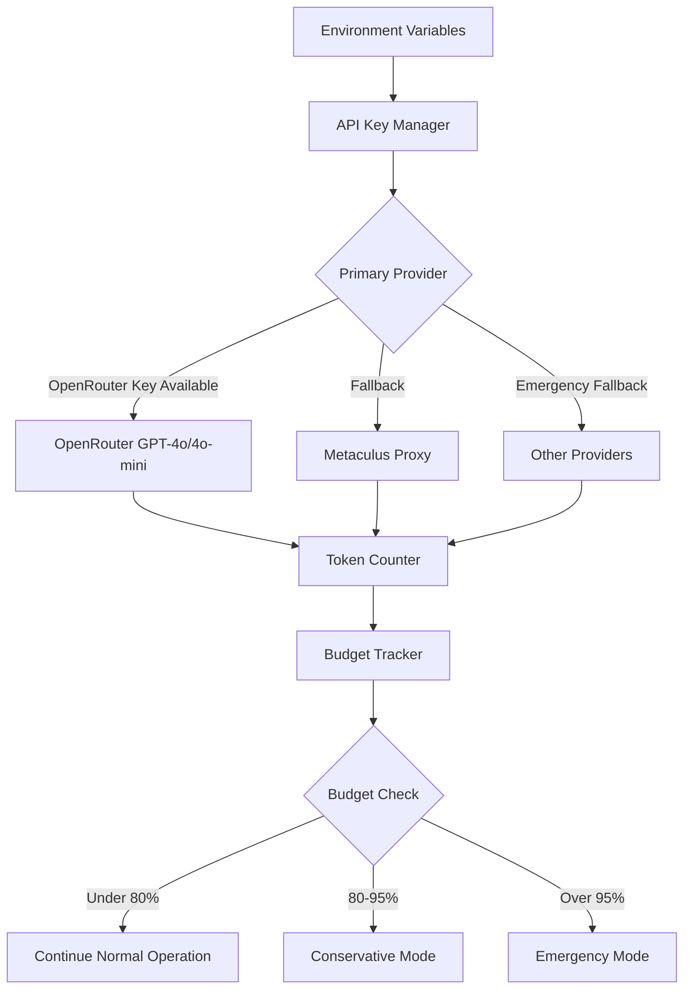
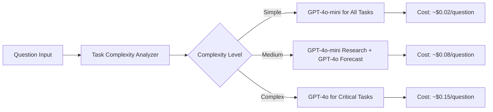

# Design Document - Tournament API Optimization and Budget Management

## Overview

This design document outlines the technical approach for optimizing the Metaculus AI Forecasting Bot based on feedback from Ben at Metaculus. The design focuses on efficient use of the $100 OpenRouter API credit, appropriate tournament scheduling, and enhanced prompt engineering for maximum accuracy per dollar spent.

## Architecture

### API Key Management and Cost Control



### Smart Model Selection Strategy



## Components and Interfaces

### 1. Enhanced API Configuration

**File**: `main.py` (modifications)

```python
class OptimizedTemplateForecaster(ForecastBot):
    def __init__(self, *args, **kwargs):
        super().__init__(*args, **kwargs)

        # Budget management
        self.budget_limit = float(os.getenv("BUDGET_LIMIT", "100"))
        self.current_spend = 0.0
        self.questions_processed = 0

        # Token tracking
        self.token_tracker = TokenTracker()

        # Model configuration with cost optimization
        self.model_config = self._setup_cost_optimized_models()

    def _setup_cost_optimized_models(self):
        """Configure models based on budget and task requirements"""
        openrouter_key = os.getenv("OPENROUTER_API_KEY", "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")

        return {
            "research": GeneralLlm(
                model="openai/gpt-4o-mini",
                api_key=openrouter_key,
                temperature=0.3,
                max_tokens=1500
            ),
            "forecast": GeneralLlm(
                model="openai/gpt-4o",
                api_key=openrouter_key,
                temperature=0.1,
                max_tokens=2000
            ),
            "simple": GeneralLlm(
                model="openai/gpt-4o-mini",
                api_key=openrouter_key,
                temperature=0.1,
                max_tokens=1000
            )
        }
```

### 2. Budget Tracking and Cost Control

**New Component**: `BudgetManager`

```python
class BudgetManager:
    def __init__(self, budget_limit: float = 100.0):
        self.budget_limit = budget_limit
        self.current_spend = 0.0
        self.cost_per_token = {
            "gpt-4o": {"input": 0.0025/1000, "output": 0.01/1000},
            "gpt-4o-mini": {"input": 0.00015/1000, "output": 0.0006/1000}
        }

    def estimate_cost(self, model: str, input_tokens: int, output_tokens: int) -> float:
        """Estimate cost for a model call"""
        rates = self.cost_per_token.get(model, self.cost_per_token["gpt-4o"])
        return (input_tokens * rates["input"]) + (output_tokens * rates["output"])

    def can_afford(self, estimated_cost: float) -> bool:
        """Check if we can afford the estimated cost"""
        return (self.current_spend + estimated_cost) <= (self.budget_limit * 0.95)

    def get_budget_status(self) -> dict:
        """Get current budget utilization status"""
        utilization = self.current_spend / self.budget_limit
        return {
            "spent": self.current_spend,
            "remaining": self.budget_limit - self.current_spend,
            "utilization": utilization,
            "status": self._get_status_level(utilization)
        }

    def _get_status_level(self, utilization: float) -> str:
        if utilization < 0.8:
            return "normal"
        elif utilization < 0.95:
            return "conservative"
        else:
            return "emergency"
```

### 3. Enhanced Prompt Templates

**Research Prompt Template**:
```python
RESEARCH_PROMPT_TEMPLATE = """You are a research assistant for a professional forecaster. Your task is to provide a concise, structured research summary.

QUESTION: {question_text}
BACKGROUND: {background_info}
RESOLUTION CRITERIA: {resolution_criteria}

RESEARCH TASKS:
1. Find recent developments (last 48 hours) related to this topic
2. Identify relevant historical precedents and base rates
3. Look for expert opinions or official statements
4. Note any scheduled events or announcements

OUTPUT FORMAT (max 3 paragraphs):
RECENT_DEVELOPMENTS: [Key news from last 48 hours with sources]
HISTORICAL_CONTEXT: [Relevant precedents and base rates]
EXPERT_OPINIONS: [Authoritative sources and their views]

Do NOT provide forecasts or predictions. Focus on factual information with source citations."""
```

**Forecasting Prompt Template**:
```python
FORECAST_PROMPT_TEMPLATE = """You are a professional forecaster participating in the Metaculus AI Benchmark Tournament.

QUESTION: {question_text}
TYPE: {question_type}
BACKGROUND: {background_info}
RESOLUTION_CRITERIA: {resolution_criteria}
CURRENT_DATE: {current_date}
CLOSE_DATE: {close_date}

RESEARCH SUMMARY:
{research_summary}

FORECASTING INSTRUCTIONS:
1. Analyze the time remaining until resolution
2. Consider the status quo if nothing changes
3. Describe a plausible path to a "No" outcome
4. Describe a plausible path to a "Yes" outcome
5. Apply proper calibration - avoid overconfidence

CALIBRATION GUIDELINES:
- Use 60-80% range instead of 95%+ when uncertain
- Consider base rates and historical precedents
- Account for your uncertainty about the evidence

OUTPUT FORMAT:
(a) Time until resolution: [X days/months]
(b) Status quo outcome: [What happens if nothing changes]
(c) Path to "No": [Brief scenario description]
(d) Path to "Yes": [Brief scenario description]

Final answer: "Probability: XX%" (where XX is 0-100)"""
```

### 4. Tournament Scheduling Optimization

**GitHub Actions Configuration**:
```yaml
# Optimized scheduling based on tournament scope
schedule:
  # Every 4 hours during active periods
  - cron: '0 */4 * * *'

  # More frequent near deadlines (configurable)
  # - cron: '0 */2 * * *'  # Enable for deadline periods
```

**Environment Variables**:
```bash
# Budget and cost control
BUDGET_LIMIT=100
COST_TRACKING_ENABLED=true
EMERGENCY_MODE_THRESHOLD=0.95

# Tournament configuration
AIB_TOURNAMENT_ID=32813
TOURNAMENT_SCOPE=seasonal  # not daily
EXPECTED_QUESTIONS=75  # realistic estimate for tournament duration
SCHEDULING_FREQUENCY=4h  # hours between runs

# Model selection
PRIMARY_RESEARCH_MODEL=openai/gpt-4o-mini
PRIMARY_FORECAST_MODEL=openai/gpt-4o
SIMPLE_TASK_MODEL=openai/gpt-4o-mini
```

## Data Models

### Cost Tracking Model
```python
@dataclass
class CostTrackingRecord:
    timestamp: datetime
    question_id: str
    model_used: str
    input_tokens: int
    output_tokens: int
    estimated_cost: float
    task_type: str  # "research" or "forecast"
    success: bool
```

### Budget Status Model
```python
@dataclass
class BudgetStatus:
    total_budget: float
    spent: float
    remaining: float
    utilization_percentage: float
    questions_processed: int
    average_cost_per_question: float
    estimated_questions_remaining: int
    status_level: str  # "normal", "conservative", "emergency"
```

## Error Handling

### Budget Exhaustion Handling
1. **80% Budget Used**: Switch to conservative mode (GPT-4o-mini for all tasks)
2. **95% Budget Used**: Emergency mode (minimal forecasting, focus on highest-value questions)
3. **100% Budget Used**: Graceful shutdown with detailed reporting

### API Failure Handling
1. **OpenRouter Primary**: Use provided key as primary
2. **Metaculus Proxy Fallback**: If available and OpenRouter fails
3. **Emergency Fallback**: Other configured providers for critical questions

## Testing Strategy

### Budget Testing
- **Unit Tests**: Cost calculation accuracy
- **Integration Tests**: Budget tracking across multiple questions
- **Load Tests**: Budget behavior under high question volume

### Prompt Optimization Testing
- **A/B Testing**: Compare prompt efficiency (accuracy per token)
- **Calibration Testing**: Measure overconfidence reduction
- **Cost-Effectiveness Testing**: Accuracy vs. cost trade-offs

### Tournament Simulation
- **Dry Run Mode**: Test complete workflow without submissions
- **Budget Simulation**: Simulate full tournament with cost tracking
- **Performance Benchmarking**: Compare against baseline performance

## Performance Optimization

### Token Efficiency
- **Prompt Compression**: Remove redundant information
- **Context Management**: Optimal context window usage
- **Response Parsing**: Efficient extraction of key information

### Model Selection Optimization
- **Task Complexity Analysis**: Automatic model selection based on question complexity
- **Performance Monitoring**: Track accuracy vs. cost for model selection refinement
- **Adaptive Thresholds**: Dynamic adjustment based on budget utilization

## Monitoring and Analytics

### Real-time Monitoring
- Budget utilization dashboard
- Cost per question tracking
- Model performance metrics
- API success rates

### Tournament Analytics
- Forecast accuracy trends
- Calibration performance
- Cost efficiency metrics
- Competitive positioning

This design ensures efficient use of the $100 budget while maintaining competitive performance in the tournament through smart resource allocation and optimized prompt engineering.
