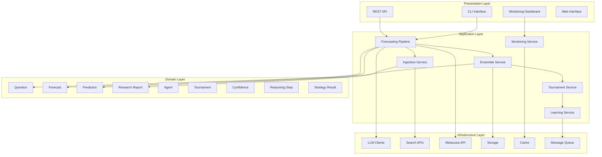
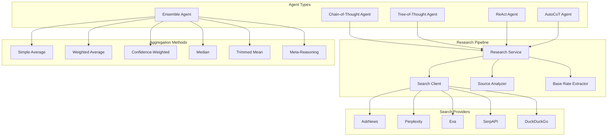

# Design Document - Tournament Optimization System

## Overview

The Tournament Optimization System is a production-grade, scalable AI forecasting platform designed to achieve competitive performance in the AIBQ2 tournament. The system follows Clean Architecture principles with clear separation of concerns across Domain, Application, and Infrastructure layers, orchestrating multiple specialized AI agents using advanced prompt engineering strategies to generate high-quality predictions.

The system builds upon the existing Metaculus Agentic Bot architecture found in `main.py`, `main_agent.py`, and the `src/` directory structure while introducing comprehensive tournament optimization capabilities including multi-provider research pipelines, ensemble intelligence, real-time learning, and production-grade reliability features.

## Architecture

### High-Level System Architecture



### Agent Orchestration Architecture



### Clean Architecture Implementation

#### Presentation Layer (`src/presentation/`)
- **CLI Interface**: Command-line interface for batch processing and manual operations
- **REST API**: RESTful endpoints for external integrations and monitoring
- **Web Dashboard**: Real-time monitoring and management interface
- **Health Checks**: System health and readiness endpoints

#### Application Layer (`src/application/`)
- **Use Cases**:
  - `ProcessTournamentQuestion`: Complete question processing workflow
  - `GenerateForecast`: Multi-agent forecast generation
  - `OptimizeStrategy`: Tournament strategy optimization
  - `ConductResearch`: Multi-provider research orchestration
  - `AggregateEnsemble`: Ensemble prediction aggregation
- **Services**:
  - `TournamentService`: Tournament-specific logic and optimization
  - `EnsembleService`: Multi-agent orchestration and aggregation
  - `LearningService`: Adaptive learning and strategy refinement
  - `ResearchService`: Multi-provider research coordination
  - `MonitoringService`: Performance tracking and alerting
- **Interfaces**: Repository abstractions, External service contracts

#### Domain Layer (`src/domain/`)
- **Entities**:
  - `Question`: Tournament questions with metadata and constraints
  - `Forecast`: Complete forecasting results with confidence and reasoning
  - `Tournament`: Tournament structure, rules, and standings
  - `Agent`: AI agent definitions with performance history
  - `Prediction`: Individual agent predictions with metadata
  - `ResearchReport`: Comprehensive research findings and analysis
- **Value Objects**:
  - `Confidence`: Immutable confidence levels with basis explanations
  - `ReasoningStep`: Individual reasoning steps with traceability
  - `StrategyResult`: Tournament strategy outcomes and effectiveness
  - `PredictionResult`: Structured prediction results with validation
  - `SourceCredibility`: Source reliability and authority scoring
- **Domain Services**:
  - `ReasoningService`: Advanced multi-step reasoning logic
  - `StrategyService`: Tournament strategy selection and optimization
  - `RiskService`: Risk assessment and calibration management
  - `AggregationService`: Ensemble prediction combination algorithms

#### Infrastructure Layer (`src/infrastructure/`)
- **External APIs**:
  - Enhanced Metaculus client with retry and circuit breaker
  - Multi-provider search integration (AskNews, Perplexity, Exa, SerpAPI, DuckDuckGo)
  - LLM provider abstractions with failover
- **Persistence**:
  - Performance metrics storage with time-series data
  - Strategy and configuration persistence
  - Research cache with TTL management
  - Audit logging with structured data
- **Monitoring**:
  - Structured JSON logging with correlation IDs
  - Prometheus metrics integration
  - Distributed tracing support
  - Health check implementations
- **Security**:
  - Credential management and rotation
  - Input validation and sanitization
  - Rate limiting and circuit breakers

## Core Components and Interfaces

### 1. Agent Orchestration System

**Location**: `src/domain/services/agent_orchestration.py`

```python
from abc import ABC, abstractmethod
from typing import List, Dict, Any
from dataclasses import dataclass

class BaseAgent(ABC):
    """Abstract base class defining agent interface"""

    @abstractmethod
    async def conduct_research(self, question: Question) -> ResearchReport:
        """Conduct comprehensive research for the given question"""
        pass

    @abstractmethod
    async def generate_prediction(self, question: Question, research: ResearchReport) -> Prediction:
        """Generate prediction based on question and research"""
        pass

    @abstractmethod
    async def forecast(self, question: Question) -> Forecast:
        """Complete forecasting workflow"""
        pass

class ChainOfThoughtAgent(BaseAgent):
    """Step-by-step reasoning agent with explicit thought chains"""

    def __init__(self, llm_client: LLMClient, reasoning_style: ReasoningStyle):
        self.llm_client = llm_client
        self.reasoning_style = reasoning_style

    async def conduct_research(self, question: Question) -> ResearchReport:
        """Systematic research with documented reasoning steps"""
        pass

class TreeOfThoughtAgent(BaseAgent):
    """Parallel reasoning paths agent exploring multiple solution branches"""

    async def explore_branches(self, question: Question, depth: int = 3) -> List[ReasoningBranch]:
        """Explore multiple reasoning paths in parallel"""
        pass

class ReActAgent(BaseAgent):
    """Reasoning + Acting agent with iterative refinement"""

    async def reason_act_cycle(self, question: Question, max_iterations: int = 5) -> ReasoningTrace:
        """Iterative reasoning and action cycle"""
        pass

class EnsembleAgent:
    """Orchestrates multiple agents and aggregates their predictions"""

    def __init__(self, agents: List[BaseAgent], aggregation_method: AggregationMethod):
        self.agents = agents
        self.aggregation_method = aggregation_method

    async def aggregate_predictions(self, predictions: List[Prediction]) -> AggregatedPrediction:
        """Combine predictions using sophisticated aggregation methods"""
        pass

    def calculate_consensus_metrics(self, predictions: List[Prediction]) -> ConsensusMetrics:
        """Calculate consensus strength, variance, and diversity scores"""
        pass
```

### 2. Multi-Provider Research Pipeline

**Location**: `src/infrastructure/research/research_pipeline.py`

```python
class SearchClient:
    """Multi-provider search abstraction with failover"""

    def __init__(self, providers: List[SearchProvider]):
        self.providers = providers
        self.circuit_breakers = {provider.name: CircuitBreaker() for provider in providers}

    async def search(self, query: str, provider_preference: Optional[str] = None) -> SearchResults:
        """Search with automatic provider failover"""
        pass

class ResearchService:
    """Coordinates research activities across multiple sources"""

    def __init__(self, search_client: SearchClient, source_analyzer: SourceAnalyzer):
        self.search_client = search_client
        self.source_analyzer = source_analyzer

    async def conduct_comprehensive_research(self, question: Question) -> ResearchReport:
        """Orchestrate multi-source research with quality analysis"""
        pass

class SourceAnalyzer:
    """Evaluates source credibility and authority"""

    def evaluate_credibility(self, source: Source) -> CredibilityScore:
        """Score source based on authority, recency, relevance"""
        pass

    def cross_validate_sources(self, sources: List[Source]) -> ValidationReport:
        """Cross-validate information across multiple sources"""
        pass

class BaseRateExtractor:
    """Identifies historical patterns and reference class data"""

    def extract_base_rates(self, question: Question, research: ResearchReport) -> BaseRateData:
        """Extract relevant historical patterns and base rates"""
        pass
```

### 3. Advanced Reasoning Engine

**Location**: `src/domain/services/reasoning_service.py`

```python
class AdvancedReasoningEngine:
    """Multi-step reasoning with explicit chain-of-thought documentation"""

    def __init__(self, knowledge_base: KnowledgeBase, chain_processor: ChainOfThoughtProcessor):
        self.knowledge_base = knowledge_base
        self.chain_processor = chain_processor

    async def process_question(self, question: Question) -> ReasoningResult:
        """Multi-step reasoning with explicit chain-of-thought documentation"""
        reasoning_steps = []

        # Step 1: Problem decomposition
        sub_problems = await self.decompose_problem(question)
        reasoning_steps.append(ReasoningStep.create(
            step_number=1,
            description="Problem decomposition",
            input_data={"question": question.to_dict()},
            output_data={"sub_problems": [sp.to_dict() for sp in sub_problems]},
            confidence_level=0.9,
            confidence_basis="Systematic decomposition approach"
        ))

        # Step 2: Perspective analysis
        perspectives = await self.consider_perspectives(question)
        reasoning_steps.append(ReasoningStep.create(
            step_number=2,
            description="Multi-perspective analysis",
            input_data={"question": question.to_dict(), "sub_problems": sub_problems},
            output_data={"perspectives": [p.to_dict() for p in perspectives]},
            confidence_level=0.8,
            confidence_basis="Comprehensive perspective coverage"
        ))

        return ReasoningResult(
            question_id=question.id,
            reasoning_steps=reasoning_steps,
            final_conclusion=self._synthesize_conclusion(sub_problems, perspectives),
            confidence=self._calculate_overall_confidence(reasoning_steps)
        )

    async def decompose_problem(self, question: Question) -> List[SubProblem]:
        """Break complex scenarios into analyzable components"""
        pass

    async def consider_perspectives(self, question: Question) -> List[Perspective]:
        """Analyze multiple viewpoints and potential biases"""
        pass
```

### 2. Tournament Strategy Engine

**Location**: `src/application/services/tournament_service.py`

```python
class TournamentStrategyEngine:
    def __init__(self, question_categorizer: QuestionCategorizer,
                 strategy_selector: StrategySelector):
        self.question_categorizer = question_categorizer
        self.strategy_selector = strategy_selector

    def analyze_tournament_question(self, question: Question) -> StrategyResult:
        """Identify question categories and apply specialized strategies"""
        pass

    def prioritize_questions(self, questions: List[Question]) -> List[PrioritizedQuestion]:
        """Prioritize based on confidence levels and scoring potential"""
        pass

    def optimize_timing(self, questions: List[Question], deadline: datetime) -> TimingStrategy:
        """Optimize submission timing for maximum impact"""
        pass
```

### 3. Enhanced Evidence Gatherer

**Location**: `src/infrastructure/external_apis/evidence_gatherer.py`

```python
class EnhancedEvidenceGatherer:
    def __init__(self, sources: List[EvidenceSource],
                 credibility_evaluator: SourceCredibilityEvaluator):
        self.sources = sources
        self.credibility_evaluator = credibility_evaluator

    def gather_evidence(self, question: Question) -> EvidenceCollection:
        """Query multiple authoritative sources"""
        pass

    def evaluate_credibility(self, evidence: Evidence) -> CredibilityScore:
        """Evaluate source credibility and recency"""
        pass

    def synthesize_information(self, evidence_collection: EvidenceCollection) -> SynthesizedEvidence:
        """Weigh evidence quality and synthesize conclusions"""
        pass
```

### 4. Ensemble Intelligence Optimizer

**Location**: `src/application/services/ensemble_service.py`

```python
class EnsembleIntelligenceOptimizer:
    def __init__(self, agents: List[ForecastAgent],
                 aggregator: PredictionAggregator):
        self.agents = agents
        self.aggregator = aggregator

    def run_ensemble_forecast(self, question: Question) -> EnsembleForecast:
        """Employ agents with distinct reasoning styles"""
        pass

    def aggregate_predictions(self, predictions: List[Prediction]) -> AggregatedPrediction:
        """Use sophisticated aggregation beyond simple averaging"""
        pass

    def analyze_disagreement(self, predictions: List[Prediction]) -> DisagreementAnalysis:
        """Analyze divergence sources and weight accordingly"""
        pass
```

## Comprehensive Data Models

### Core Entities

```python
from dataclasses import dataclass
from typing import List, Dict, Any, Optional, Union
from datetime import datetime
from uuid import UUID
from enum import Enum

@dataclass
class Question:
    """Tournament question with comprehensive metadata"""
    id: UUID
    metaculus_id: int
    title: str
    description: str
    question_type: QuestionType  # BINARY, NUMERIC, MULTIPLE_CHOICE
    status: QuestionStatus
    close_time: datetime
    categories: List[str]
    background: str
    resolution_criteria: str
    scoring_weight: float
    metadata: Dict[str, Any]
    created_at: datetime

    def is_active(self) -> bool:
        return self.status == QuestionStatus.ACTIVE and self.close_time > datetime.utcnow()

    def time_until_close(self) -> float:
        return (self.close_time - datetime.utcnow()).total_seconds() / 3600

@dataclass
class Prediction:
    """Individual agent prediction with metadata"""
    id: UUID
    question_id: UUID
    result: PredictionResult
    confidence: PredictionConfidence
    method: PredictionMethod
    reasoning: str
    created_by: str
    timestamp: datetime
    metadata: Dict[str, Any]

    def to_submission_format(self) -> Dict[str, Any]:
        """Convert to Metaculus submission format"""
        pass

@dataclass
class Forecast:
    """Complete forecast with ensemble results"""
    id: UUID
    question_id: UUID
    predictions: List[Prediction]
    final_prediction: Prediction
    research_reports: List[ResearchReport]
    ensemble_method: str
    confidence_score: float
    consensus_metrics: ConsensusMetrics
    timestamp: datetime

    def get_prediction_variance(self) -> float:
        """Calculate variance across agent predictions"""
        pass

@dataclass
class ResearchReport:
    """Comprehensive research findings"""
    id: UUID
    question_id: UUID
    sources: List[Source]
    credibility_scores: Dict[str, float]
    evidence_synthesis: str
    base_rates: BaseRateData
    knowledge_gaps: List[str]
    research_quality_score: float
    timestamp: datetime

@dataclass
class Tournament:
    """Tournament structure with rules and standings"""
    id: UUID
    name: str
    questions: List[Question]
    scoring_rules: ScoringRules
    start_time: datetime
    end_time: datetime
    current_standings: Dict[str, float]
    participant_count: int
    metadata: Dict[str, Any]

    def get_active_questions(self) -> List[Question]:
        return [q for q in self.questions if q.is_active()]

@dataclass
class Agent:
    """AI agent with performance tracking"""
    id: str
    name: str
    reasoning_style: ReasoningStyle
    knowledge_domains: List[str]
    performance_history: PerformanceHistory
    configuration: Dict[str, Any]
    is_active: bool
    version: str
    created_at: datetime

    def get_specialization_score(self, category: str) -> float:
        """Calculate agent's specialization for question category"""
        pass
```

### Value Objects

```python
@dataclass(frozen=True)
class Confidence:
    """Immutable confidence level with basis explanation"""
    level: float  # 0.0 to 1.0
    basis: str    # Explanation of confidence level

    def __post_init__(self):
        if not 0.0 <= self.level <= 1.0:
            raise ValueError(f"Confidence level must be between 0.0 and 1.0, got {self.level}")

    def is_high(self) -> bool:
        return self.level >= 0.8

    def combine_with(self, other: 'Confidence', weight: float = 0.5) -> 'Confidence':
        """Combine with another confidence using weighted average"""
        pass

@dataclass(frozen=True)
class ReasoningStep:
    """Individual reasoning step with traceability"""
    step_number: int
    description: str
    input_data: Dict[str, Any]
    output_data: Dict[str, Any]
    confidence: Confidence
    timestamp: datetime
    reasoning_type: Optional[str] = None

    def to_summary(self) -> str:
        return f"Step {self.step_number}: {self.description}"

@dataclass(frozen=True)
class StrategyResult:
    """Tournament strategy outcome with effectiveness metrics"""
    strategy_type: StrategyType
    outcome: StrategyOutcome
    confidence: Confidence
    expected_score: float
    actual_score: Optional[float]
    reasoning: str
    metadata: Dict[str, Any]
    timestamp: datetime
    question_ids: List[int]

    def get_effectiveness_score(self) -> Optional[float]:
        if self.actual_score is None:
            return None
        return self.actual_score - self.expected_score

@dataclass(frozen=True)
class PredictionResult:
    """Structured prediction result with validation"""
    value: Union[float, Dict[str, float]]
    prediction_type: PredictionType
    bounds: Optional[tuple[float, float]] = None

    def validate(self) -> bool:
        """Validate prediction format and constraints"""
        pass

@dataclass(frozen=True)
class SourceCredibility:
    """Source reliability and authority scoring"""
    authority_score: float
    recency_score: float
    relevance_score: float
    cross_validation_score: float

    @property
    def overall_score(self) -> float:
        return (self.authority_score + self.recency_score +
                self.relevance_score + self.cross_validation_score) / 4
```

### Supporting Types and Enums

```python
class QuestionType(Enum):
    BINARY = "binary"
    NUMERIC = "numeric"
    MULTIPLE_CHOICE = "multiple_choice"

class QuestionStatus(Enum):
    ACTIVE = "active"
    CLOSED = "closed"
    RESOLVED = "resolved"

class ReasoningStyle(Enum):
    CHAIN_OF_THOUGHT = "chain_of_thought"
    TREE_OF_THOUGHT = "tree_of_thought"
    REACT = "react"
    AUTO_COT = "auto_cot"

class StrategyType(Enum):
    AGGRESSIVE = "aggressive"
    CONSERVATIVE = "conservative"
    BALANCED = "balanced"
    CONTRARIAN = "contrarian"

class AggregationMethod(Enum):
    SIMPLE_AVERAGE = "simple_average"
    WEIGHTED_AVERAGE = "weighted_average"
    CONFIDENCE_WEIGHTED = "confidence_weighted"
    MEDIAN = "median"
    TRIMMED_MEAN = "trimmed_mean"
    META_REASONING = "meta_reasoning"

@dataclass
class ConsensusMetrics:
    """Ensemble consensus quality metrics"""
    consensus_strength: float
    prediction_variance: float
    agent_diversity_score: float
    confidence_alignment: float
```

## Error Handling and Resilience

### Exception Hierarchy

```python
class TournamentOptimizationError(Exception):
    """Base exception for tournament optimization system"""
    def __init__(self, message: str, error_code: str = None, context: Dict[str, Any] = None):
        super().__init__(message)
        self.error_code = error_code
        self.context = context or {}
        self.timestamp = datetime.utcnow()

class ReasoningError(TournamentOptimizationError):
    """Errors in reasoning process"""
    pass

class EvidenceGatheringError(TournamentOptimizationError):
    """Errors in evidence collection"""
    pass

class StrategyError(TournamentOptimizationError):
    """Errors in strategy execution"""
    pass

class CalibrationError(TournamentOptimizationError):
    """Errors in calibration management"""
    pass

class ExternalServiceError(TournamentOptimizationError):
    """Errors from external service integrations"""
    pass

class ValidationError(TournamentOptimizationError):
    """Data validation errors"""
    pass
```

### Circuit Breaker Implementation

```python
class CircuitBreaker:
    """Circuit breaker for external service protection"""

    def __init__(self, failure_threshold: int = 5, recovery_timeout: int = 60):
        self.failure_threshold = failure_threshold
        self.recovery_timeout = recovery_timeout
        self.failure_count = 0
        self.last_failure_time = None
        self.state = CircuitState.CLOSED

    async def call(self, func: Callable, *args, **kwargs):
        """Execute function with circuit breaker protection"""
        if self.state == CircuitState.OPEN:
            if self._should_attempt_reset():
                self.state = CircuitState.HALF_OPEN
            else:
                raise CircuitBreakerOpenError("Circuit breaker is open")

        try:
            result = await func(*args, **kwargs)
            self._on_success()
            return result
        except Exception as e:
            self._on_failure()
            raise

class RetryStrategy:
    """Configurable retry strategy with exponential backoff"""

    def __init__(self, max_attempts: int = 3, base_delay: float = 1.0, max_delay: float = 60.0):
        self.max_attempts = max_attempts
        self.base_delay = base_delay
        self.max_delay = max_delay

    async def execute(self, func: Callable, *args, **kwargs):
        """Execute function with retry logic"""
        last_exception = None

        for attempt in range(self.max_attempts):
            try:
                return await func(*args, **kwargs)
            except Exception as e:
                last_exception = e
                if attempt < self.max_attempts - 1:
                    delay = min(self.base_delay * (2 ** attempt), self.max_delay)
                    await asyncio.sleep(delay)

        raise last_exception
```

### Graceful Degradation Strategies

```python
class GracefulDegradationManager:
    """Manages system degradation during failures"""

    def __init__(self):
        self.degradation_levels = {
            'search_providers': ['asknews', 'perplexity', 'exa', 'serpapi', 'duckduckgo'],
            'llm_providers': ['openai', 'anthropic', 'google'],
            'ensemble_agents': ['cot', 'tot', 'react', 'autocot']
        }

    async def get_available_search_providers(self) -> List[str]:
        """Get currently available search providers"""
        available = []
        for provider in self.degradation_levels['search_providers']:
            if await self._check_provider_health(provider):
                available.append(provider)
        return available

    async def fallback_to_single_agent(self, preferred_agent: str) -> BaseAgent:
        """Fallback to single agent when ensemble fails"""
        pass
```

## Comprehensive Testing Strategy

### Unit Testing Framework

```python
# Test structure example
class TestQuestionEntity:
    """Unit tests for Question domain entity"""

    def test_question_validation(self):
        """Test question validation rules"""
        pass

    def test_question_time_calculations(self):
        """Test time-based calculations"""
        pass

    @pytest.mark.parametrize("question_type,expected", [
        (QuestionType.BINARY, True),
        (QuestionType.NUMERIC, False),
    ])
    def test_question_type_checks(self, question_type, expected):
        """Parameterized tests for question type checks"""
        pass

class TestReasoningService:
    """Unit tests for reasoning service"""

    @pytest.fixture
    def mock_llm_client(self):
        return Mock(spec=LLMClient)

    @pytest.fixture
    def reasoning_service(self, mock_llm_client):
        return ReasoningService(llm_client=mock_llm_client)

    async def test_multi_step_reasoning(self, reasoning_service):
        """Test multi-step reasoning process"""
        pass
```

### Integration Testing

```python
class TestForecastingPipeline:
    """Integration tests for complete forecasting pipeline"""

    @pytest.fixture
    async def test_database(self):
        """Test database fixture"""
        pass

    @pytest.fixture
    def mock_external_apis(self):
        """Mock all external API calls"""
        with patch('src.infrastructure.search.AskNewsClient') as mock_asknews, \
             patch('src.infrastructure.llm.OpenAIClient') as mock_openai:
            yield {
                'asknews': mock_asknews,
                'openai': mock_openai
            }

    async def test_complete_forecasting_workflow(self, test_database, mock_external_apis):
        """Test end-to-end forecasting workflow"""
        pass

    async def test_ensemble_aggregation(self, mock_external_apis):
        """Test ensemble prediction aggregation"""
        pass
```

### Performance Testing

```python
class TestPerformanceRequirements:
    """Performance and load testing"""

    @pytest.mark.performance
    async def test_response_time_targets(self):
        """Validate response time requirements"""
        start_time = time.time()

        # Execute forecasting pipeline
        result = await forecasting_pipeline.process_question(test_question)

        elapsed_time = time.time() - start_time
        assert elapsed_time < 30.0, f"Response time {elapsed_time}s exceeds 30s target"

    @pytest.mark.load
    async def test_concurrent_processing(self):
        """Test concurrent question processing"""
        questions = [create_test_question() for _ in range(100)]

        start_time = time.time()
        results = await asyncio.gather(*[
            forecasting_pipeline.process_question(q) for q in questions
        ])
        elapsed_time = time.time() - start_time

        assert len(results) == 100
        assert elapsed_time < 300.0  # 5 minutes for 100 questions
```

### Test Coverage Requirements

- **Domain Layer**: >90% coverage for all entities, value objects, and domain services
- **Application Layer**: >85% coverage for use cases and application services
- **Infrastructure Layer**: >80% coverage with comprehensive mocking of external dependencies
- **Integration Tests**: Cover all critical user journeys and component interactions
- **Performance Tests**: Validate all response time and throughput requirements

## Security Architecture

### Credential Management System

```python
class SecureCredentialManager:
    """Secure credential management with rotation support"""

    def __init__(self, vault_client: VaultClient = None):
        self.vault_client = vault_client
        self.env_credentials = {}
        self.rotation_schedule = {}

    async def get_credential(self, service: str, credential_type: str) -> str:
        """Retrieve credential with automatic rotation check"""
        if self.vault_client:
            return await self._get_from_vault(service, credential_type)
        return self._get_from_environment(service, credential_type)

    async def rotate_credential(self, service: str, credential_type: str) -> bool:
        """Rotate credential and update all dependent services"""
        pass

    def mask_sensitive_data(self, data: Dict[str, Any]) -> Dict[str, Any]:
        """Mask sensitive data in logs and responses"""
        sensitive_keys = ['api_key', 'token', 'password', 'secret']
        masked_data = data.copy()

        for key in masked_data:
            if any(sensitive in key.lower() for sensitive in sensitive_keys):
                masked_data[key] = "***MASKED***"

        return masked_data
```

### Input Validation Framework

```python
class InputValidator:
    """Comprehensive input validation and sanitization"""

    def __init__(self):
        self.validators = {
            'question_text': self._validate_question_text,
            'prediction_value': self._validate_prediction_value,
            'api_response': self._validate_api_response
        }

    def validate_input(self, input_type: str, data: Any) -> ValidationResult:
        """Validate input data based on type"""
        validator = self.validators.get(input_type)
        if not validator:
            raise ValueError(f"No validator found for input type: {input_type}")

        return validator(data)

    def _validate_question_text(self, text: str) -> ValidationResult:
        """Validate question text for XSS and injection attacks"""
        # Remove potentially dangerous HTML/script tags
        cleaned_text = self._sanitize_html(text)

        # Check for SQL injection patterns
        if self._contains_sql_injection(cleaned_text):
            return ValidationResult(valid=False, error="Potential SQL injection detected")

        return ValidationResult(valid=True, cleaned_data=cleaned_text)

    def _sanitize_html(self, text: str) -> str:
        """Remove potentially dangerous HTML content"""
        import html
        return html.escape(text)
```

### Rate Limiting and Protection

```python
class RateLimiter:
    """Rate limiting for API protection"""

    def __init__(self, redis_client: RedisClient = None):
        self.redis_client = redis_client
        self.local_cache = {}

    async def check_rate_limit(self, identifier: str, limit: int, window: int) -> bool:
        """Check if request is within rate limit"""
        current_count = await self._get_current_count(identifier, window)
        return current_count < limit

    async def record_request(self, identifier: str, window: int):
        """Record a request for rate limiting"""
        pass

class SecurityMiddleware:
    """Security middleware for request processing"""

    def __init__(self, rate_limiter: RateLimiter, input_validator: InputValidator):
        self.rate_limiter = rate_limiter
        self.input_validator = input_validator

    async def process_request(self, request: Request) -> SecurityResult:
        """Process request through security checks"""
        # Rate limiting
        if not await self.rate_limiter.check_rate_limit(
            request.client_ip, limit=100, window=3600
        ):
            return SecurityResult(allowed=False, reason="Rate limit exceeded")

        # Input validation
        validation_result = self.input_validator.validate_input(
            request.input_type, request.data
        )

        if not validation_result.valid:
            return SecurityResult(allowed=False, reason=validation_result.error)

        return SecurityResult(allowed=True, cleaned_data=validation_result.cleaned_data)
```

## Performance Requirements

### Response Time Targets
- Question processing: < 30 seconds
- Evidence gathering: < 15 seconds
- Ensemble forecasting: < 60 seconds
- Strategy optimization: < 10 seconds

### Scalability Targets
- Support 100+ concurrent questions
- Handle tournaments with 1000+ questions
- Scale to 10+ ensemble agents
- Process 10,000+ historical questions for learning

### Resource Utilization
- Memory usage: < 2GB per agent instance
- CPU utilization: < 80% during peak load
- Network bandwidth: < 10MB/s per instance
- Storage growth: < 1GB per month

## Monitoring and Observability

### Structured Logging Implementation

```python
import structlog
from typing import Dict, Any

class StructuredLogger:
    """Structured logging with correlation IDs and context"""

    def __init__(self):
        structlog.configure(
            processors=[
                structlog.stdlib.filter_by_level,
                structlog.stdlib.add_logger_name,
                structlog.stdlib.add_log_level,
                structlog.stdlib.PositionalArgumentsFormatter(),
                structlog.processors.TimeStamper(fmt="iso"),
                structlog.processors.StackInfoRenderer(),
                structlog.processors.format_exc_info,
                structlog.processors.UnicodeDecoder(),
                structlog.processors.JSONRenderer()
            ],
            context_class=dict,
            logger_factory=structlog.stdlib.LoggerFactory(),
            wrapper_class=structlog.stdlib.BoundLogger,
            cache_logger_on_first_use=True,
        )
        self.logger = structlog.get_logger()

    def log_forecasting_event(self, event_type: str, question_id: str,
                            context: Dict[str, Any], correlation_id: str = None):
        """Log forecasting events with structured data"""
        self.logger.info(
            "forecasting_event",
            event_type=event_type,
            question_id=question_id,
            correlation_id=correlation_id or self._generate_correlation_id(),
            **context
        )

    def log_performance_metrics(self, component: str, metrics: Dict[str, float]):
        """Log performance metrics"""
        self.logger.info(
            "performance_metrics",
            component=component,
            **metrics
        )
```

### Metrics Collection System

```python
from prometheus_client import Counter, Histogram, Gauge, CollectorRegistry

class MetricsCollector:
    """Prometheus metrics collection"""

    def __init__(self):
        self.registry = CollectorRegistry()

        # Forecasting metrics
        self.forecasts_total = Counter(
            'forecasts_total',
            'Total number of forecasts generated',
            ['question_type', 'agent_type'],
            registry=self.registry
        )

        self.forecast_duration = Histogram(
            'forecast_duration_seconds',
            'Time spent generating forecasts',
            ['question_type', 'agent_type'],
            registry=self.registry
        )

        self.prediction_accuracy = Gauge(
            'prediction_accuracy',
            'Current prediction accuracy by category',
            ['question_category'],
            registry=self.registry
        )

        # System metrics
        self.active_agents = Gauge(
            'active_agents_count',
            'Number of active agents',
            registry=self.registry
        )

        self.api_requests_total = Counter(
            'api_requests_total',
            'Total API requests by provider',
            ['provider', 'status'],
            registry=self.registry
        )

    def record_forecast(self, question_type: str, agent_type: str, duration: float):
        """Record forecast generation metrics"""
        self.forecasts_total.labels(
            question_type=question_type,
            agent_type=agent_type
        ).inc()

        self.forecast_duration.labels(
            question_type=question_type,
            agent_type=agent_type
        ).observe(duration)
```

### Health Check System

```python
class HealthCheckManager:
    """Comprehensive health check system"""

    def __init__(self, components: List[HealthCheckComponent]):
        self.components = components

    async def check_system_health(self) -> HealthStatus:
        """Check overall system health"""
        component_statuses = {}
        overall_healthy = True

        for component in self.components:
            try:
                status = await component.check_health()
                component_statuses[component.name] = status
                if not status.healthy:
                    overall_healthy = False
            except Exception as e:
                component_statuses[component.name] = HealthStatus(
                    healthy=False,
                    message=f"Health check failed: {str(e)}"
                )
                overall_healthy = False

        return SystemHealthStatus(
            healthy=overall_healthy,
            components=component_statuses,
            timestamp=datetime.utcnow()
        )

class DatabaseHealthCheck(HealthCheckComponent):
    """Database connectivity health check"""

    async def check_health(self) -> HealthStatus:
        try:
            await self.db_client.execute("SELECT 1")
            return HealthStatus(healthy=True, message="Database connection OK")
        except Exception as e:
            return HealthStatus(healthy=False, message=f"Database error: {str(e)}")
```

### Performance Dashboard Configuration

```python
class DashboardConfig:
    """Configuration for monitoring dashboards"""

    DASHBOARD_PANELS = {
        'forecasting_performance': {
            'title': 'Forecasting Performance',
            'metrics': [
                'prediction_accuracy',
                'forecast_duration_seconds',
                'forecasts_total'
            ],
            'time_range': '24h'
        },
        'system_health': {
            'title': 'System Health',
            'metrics': [
                'active_agents_count',
                'api_requests_total',
                'error_rate'
            ],
            'time_range': '1h'
        },
        'tournament_progress': {
            'title': 'Tournament Progress',
            'metrics': [
                'tournament_ranking',
                'questions_processed',
                'calibration_score'
            ],
            'time_range': '7d'
        }
    }
```

## Deployment Architecture

### Containerization Strategy

```dockerfile
# Multi-stage Docker build
FROM python:3.11-slim as builder

WORKDIR /app
COPY requirements.txt .
RUN pip install --no-cache-dir -r requirements.txt

FROM python:3.11-slim as runtime

WORKDIR /app
COPY --from=builder /usr/local/lib/python3.11/site-packages /usr/local/lib/python3.11/site-packages
COPY src/ ./src/
COPY config/ ./config/

# Health check
HEALTHCHECK --interval=30s --timeout=10s --start-period=5s --retries=3 \
  CMD python -c "import requests; requests.get('http://localhost:8000/health')"

CMD ["python", "-m", "src.main"]
```

### CI/CD Pipeline Configuration

```yaml
# .github/workflows/tournament-optimization.yml
name: Tournament Optimization CI/CD

on:
  push:
    branches: [main, develop]
  pull_request:
    branches: [main]

jobs:
  test:
    runs-on: ubuntu-latest
    strategy:
      matrix:
        python-version: [3.11]

    steps:
    - uses: actions/checkout@v3

    - name: Set up Python
      uses: actions/setup-python@v4
      with:
        python-version: ${{ matrix.python-version }}

    - name: Install dependencies
      run: |
        pip install poetry
        poetry install

    - name: Run unit tests
      run: poetry run pytest tests/unit/ --cov=src --cov-report=xml

    - name: Run integration tests
      run: poetry run pytest tests/integration/

    - name: Run performance tests
      run: poetry run pytest tests/performance/ -m performance

    - name: Security scan
      run: poetry run bandit -r src/

    - name: Upload coverage
      uses: codecov/codecov-action@v3

  deploy:
    needs: test
    runs-on: ubuntu-latest
    if: github.ref == 'refs/heads/main'

    steps:
    - name: Deploy to staging
      run: |
        # Deployment commands
        echo "Deploying to staging environment"

    - name: Run smoke tests
      run: |
        # Smoke test commands
        echo "Running smoke tests"

    - name: Deploy to production
      if: success()
      run: |
        # Production deployment
        echo "Deploying to production"
```

This comprehensive design document provides a production-ready foundation for implementing the tournament optimization system with:

- **Clean Architecture** with clear layer separation
- **Multi-agent orchestration** with sophisticated aggregation
- **Resilient error handling** with circuit breakers and graceful degradation
- **Comprehensive security** with credential management and input validation
- **Production monitoring** with structured logging and metrics
- **Automated testing** with high coverage requirements
- **CI/CD pipeline** with security scanning and staged deployments

The design maintains scalability, reliability, and maintainability while supporting the complex requirements of competitive tournament forecasting.
