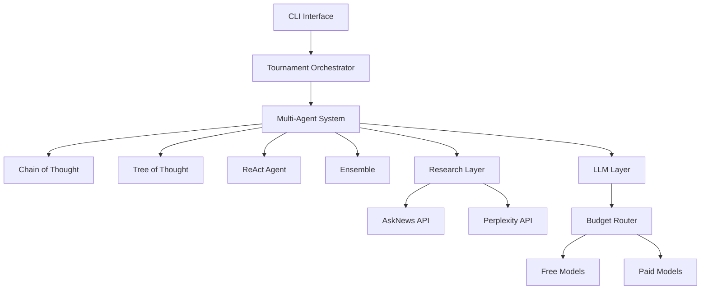
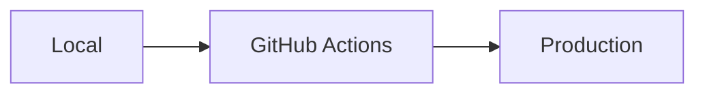
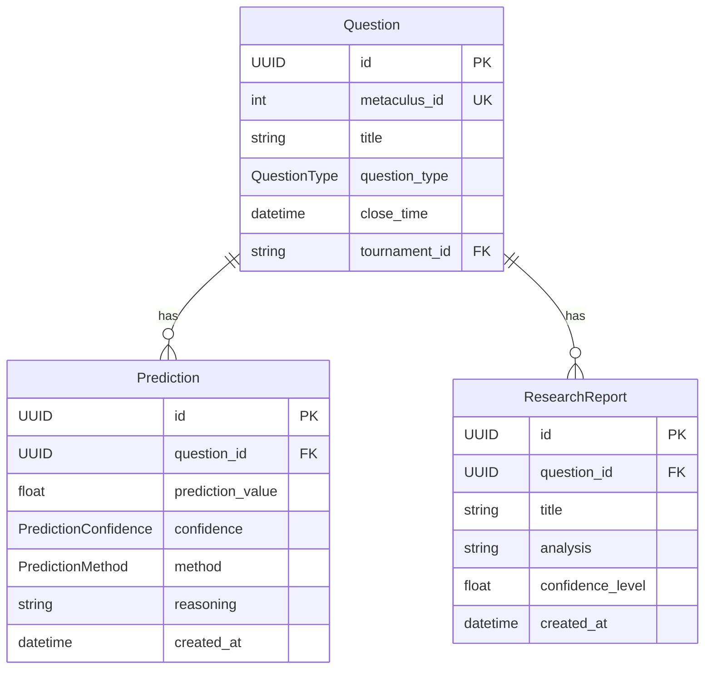

# Documentación del Proyecto

## Índice

0. [Ficha del proyecto](#0-ficha-del-proyecto)
1. [Descripción general del producto](#1-descripción-general-del-producto)
2. [Arquitectura del sistema](#2-arquitectura-del-sistema)
3. [Modelo de datos](#3-modelo-de-datos)
4. [Especificación de la API](#4-especificación-de-la-api)
5. [Historias de usuario](#5-historias-de-usuario)
6. [Tickets de trabajo](#6-tickets-de-trabajo)
7. [Pull requests](#7-pull-requests)

---

## 0. Ficha del proyecto

### **0.1. Tu nombre completo:**

Herman Aukera

### **0.2. Nombre del proyecto:**

Metaculus Forecasting Bot HA - Tournament Edition

### **0.3. Descripción breve del proyecto:**

Bot de IA para pronósticos automatizados en torneos de Metaculus con múltiples agentes, investigación automática y gestión de presupuesto.

### **0.4. URL del proyecto:**
<https://github.com/herman-aukera/metac-bot-ha>

### 0.5. URL o archivo comprimido del repositorio
<https://github.com/herman-aukera/metac-bot-ha> (repositorio público)

---

## 1. Descripción general del producto

### **1.1. Objetivo:**

Automatizar la participación en torneos de Metaculus generando predicciones precisas mediante IA. Soluciona la necesidad de participación manual constante en competiciones de forecasting, dirigido a investigadores y participantes de torneos de predicción.

### **1.2. Características y funcionalidades principales:**

- **Multi-Agent System**: Chain of Thought, Tree of Thought, ReAct y Ensemble agents
- **Investigación Automática**: Integración con AskNews, Perplexity y Exa APIs
- **Gestión de Presupuesto**: Monitoreo en tiempo real y fallbacks a modelos gratuitos
- **Recuperación de Errores**: Sistema robusto con circuit breakers y fallbacks
- **Monitoreo**: Logging comprehensivo y métricas de rendimiento

### **1.3. Diseño y experiencia de usuario:**

El bot opera principalmente por CLI y API. La interfaz principal es:

```bash
# Ejecutar torneo
python3 -m src.main --tournament 32813 --max-questions 10

# Validar sistema
python3 scripts/validate_tournament_integration.py
```

No hay interfaz gráfica - es un sistema backend automatizado.

### **1.4. Instrucciones de instalación:**

```bash
# 1. Clonar repositorio
git clone https://github.com/herman-aukera/metac-bot-ha.git
cd metac-bot-ha

# 2. Instalar dependencias
pip install -r requirements.txt

# 3. Configurar variables de entorno
cp .env.template .env
# Editar .env con API keys

# 4. Ejecutar
python3 -m src.main --tournament 32813 --dry-run
```

---

## 2. Arquitectura del Sistema

### **2.1. Diagrama de arquitectura:**



**Patrón**: Arquitectura por capas con Domain-Driven Design. Elegida por separación de responsabilidades y escalabilidad. Beneficio: mantenibilidad y testing. Sacrificio: complejidad inicial.

### **2.2. Descripción de componentes principales:**

- **Tournament Orchestrator**: Coordina ejecución del torneo (Python asyncio)
- **Multi-Agent System**: Diferentes estrategias de razonamiento (Strategy pattern)
- **Research Layer**: APIs externas con fallbacks (AskNews, Perplexity)
- **Budget Router**: Gestión inteligente de costos (Python)

### **2.3. Descripción de alto nivel del proyecto y estructura de ficheros**

```
src/
├── agents/          # Agentes de IA
├── application/     # Lógica de aplicación
├── domain/         # Entidades y servicios de dominio
├── infrastructure/ # APIs externas y configuración
└── pipelines/      # Pipelines de procesamiento
```

Sigue Domain-Driven Design con Clean Architecture.

### **2.4. Infraestructura y despliegue**



Despliegue: GitHub Actions → Testing automático → Despliegue a servidor cloud.

### **2.5. Seguridad**

- Variables de entorno para API keys
- Validación de entrada en entidades
- Rate limiting en Budget Router
- Logging sin información sensible

### **2.6. Tests**

- Tests unitarios para cada agente
- Tests de integración para workflows completos
- Tests de deployment para validar configuración

---

## 3. Modelo de Datos

### **3.1. Diagrama del modelo de datos:**



### **3.2. Descripción de entidades principales:**

**Question**: Pregunta de Metaculus

- id: UUID, PK
- metaculus_id: int, UK, no nulo
- title: string, no nulo
- question_type: enum (BINARY, NUMERIC, MULTIPLE_CHOICE)
- close_time: datetime, no nulo

**Prediction**: Predicción generada

- id: UUID, PK
- question_id: UUID, FK a Question
- prediction_value: float (0-1 para binarias)
- confidence: enum (LOW, MEDIUM, HIGH)
- method: enum (CHAIN_OF_THOUGHT, ENSEMBLE, etc.)

**ResearchReport**: Investigación realizada

- id: UUID, PK
- question_id: UUID, FK a Question
- analysis: string, análisis detallado
- confidence_level: float (0-1)

---

## 4. Especificación de la API

```yaml
/api/v1/forecast:
  post:
    summary: Generar predicción
    requestBody:
      required: true
      content:
        application/json:
          schema:
            type: object
            properties:
              question_id:
                type: integer
                example: 12345
              agent_type:
                type: string
                enum: [ensemble, chain_of_thought]
    responses:
      '200':
        description: Predicción generada
        content:
          application/json:
            schema:
              type: object
              properties:
                prediction:
                  type: number
                  example: 0.67
                confidence:
                  type: number
                  example: 0.85
```

**Ejemplo petición:**

```json
{"question_id": 12345, "agent_type": "ensemble"}
```

**Ejemplo respuesta:**

```json
{"prediction": 0.67, "confidence": 0.85, "reasoning": "Based on analysis..."}
```

---

## 5. Historias de Usuario

**Historia de Usuario 1**
Como participante en torneo de Metaculus, quiero que el bot genere predicciones automáticamente para poder competir sin intervención manual constante.

**Historia de Usuario 2**
Como sistema de forecasting, quiero realizar investigación automática con múltiples fuentes para generar predicciones más informadas.

**Historia de Usuario 3**
Como operador del bot, quiero gestión automática de presupuesto para evitar gastos excesivos y mantener operación dentro de límites.

---

## 6. Tickets de Trabajo

**Ticket 1 (Backend)**
Implementar sistema de recuperación ante errores para APIs externas con circuit breakers, fallbacks automáticos y retry con exponential backoff. Incluye logging detallado y métricas de disponibilidad.

**Ticket 2 (Frontend)**
Crear dashboard web para monitoreo en tiempo real con métricas de rendimiento, uso de presupuesto, estado de componentes y log viewer con filtros.

**Ticket 3 (Base de Datos)**
Optimizar esquema de base de datos con índices para consultas frecuentes, particionado de tablas grandes y vistas materializadas para agregaciones complejas.

---

## 7. Pull Requests

**Pull Request 1**
`feat: Add budget-aware model routing with free fallbacks` - Implementa sistema inteligente de enrutamiento que gestiona presupuesto automáticamente y cambia a modelos gratuitos cuando necesario.

**Pull Request 2**
`fix: Resolve async coroutine issues in ReActAgent` - Corrige problemas de manejo de corrutinas async que causaban RuntimeWarnings en tests de integración.

**Pull Request 3**
`feat: Implement tournament compliance validation` - Añade sistema de validación de cumplimiento para torneos con verificación de transparencia y detección de intervención humana.
