# 🔄 System Flows & Dependencies

## 📋 Overview

This document describes the key workflows, data flows, and dependencies in the Metaculus AI Forecasting Bot system.

## 🏆 Tournament Execution Flow (Production)

### Main Tournament Flow (`main.py`)
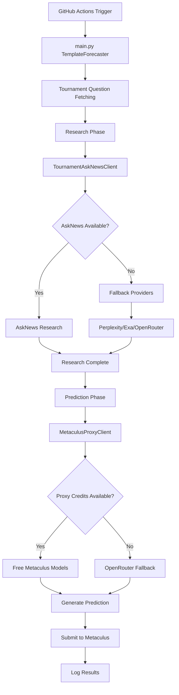

### Resource Management Flow
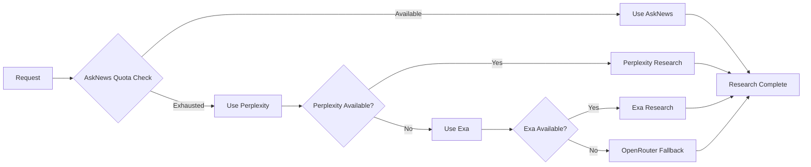

## 🏗️ New Architecture Flow (`src/main.py`)

### Complete Forecasting Pipeline
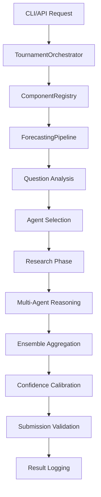

### Dependency Injection Flow
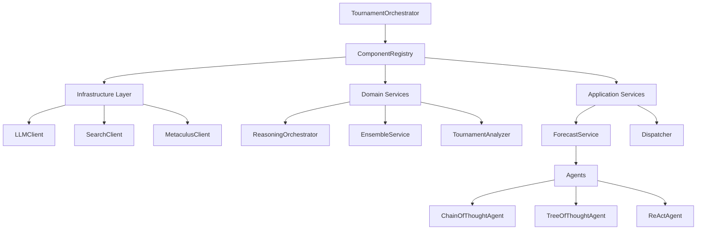

## 🧠 Reasoning Agent Workflows

### Chain of Thought Agent Flow
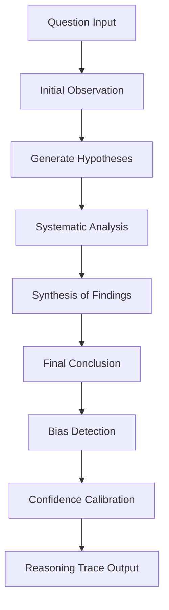

### Tree of Thought Agent Flow
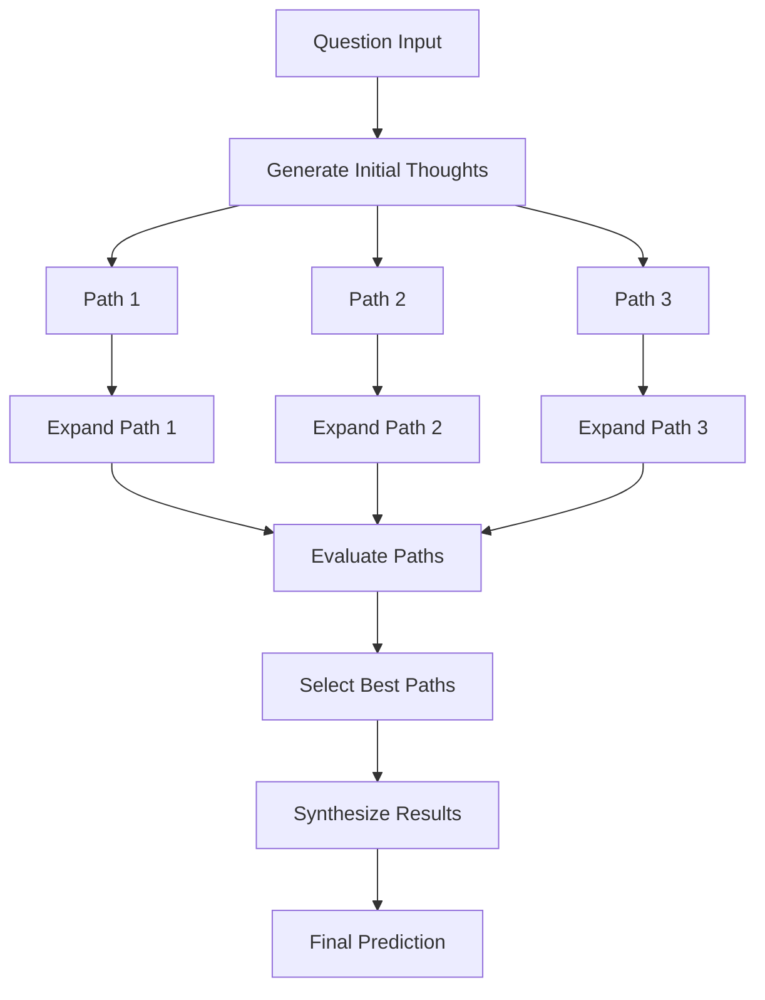

### Ensemble Coordination Flow
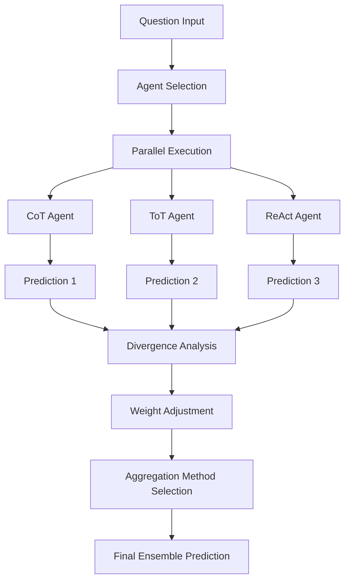

## 🔧 Configuration & Dependency Management

### Configuration Loading Flow
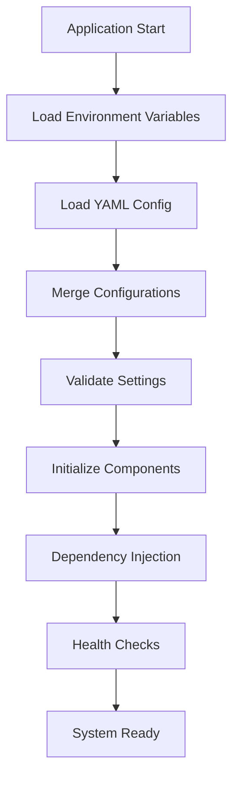

### Hot-Reload Configuration Flow
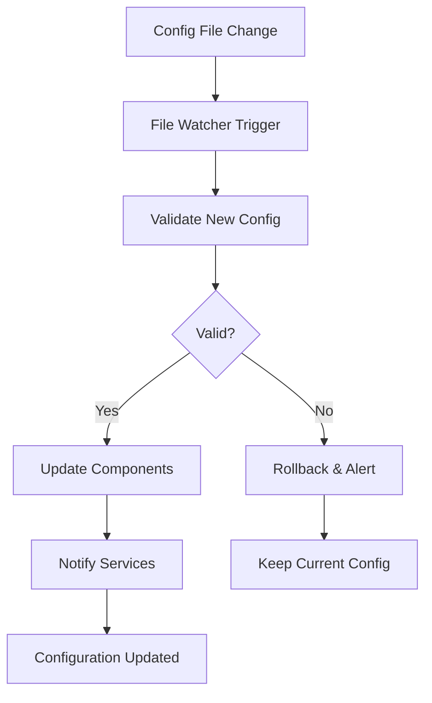
## 🏗️ Component Dependencies

### Core Dependencies Map
```
TournamentOrchestrator
├── ComponentRegistry
│   ├── Infrastructure Components
│   │   ├── LLMClient
│   │   ├── SearchClient
│   │   ├── MetaculusClient
│   │   ├── TournamentAskNewsClient
│   │   └── MetaculusProxyClient
│   │
│   ├── Domain Services (24 services)
│   │   ├── ReasoningOrchestrator
│   │   ├── EnsembleService
│   │   ├── TournamentAnalyzer
│   │   ├── ConflictResolver
│   │   ├── PerformanceAnalyzer
│   │   └── ... (19 more services)
│   │
│   ├── Application Services
│   │   ├── ForecastService
│   │   ├── Dispatcher
│   │   └── IngestionService
│   │
│   └── Agents
│       ├── ChainOfThoughtAgent
│       ├── TreeOfThoughtAgent
│       ├── ReActAgent
│       └── EnsembleAgent
│
└── ForecastingPipeline
    └── All above components via dependency injection
```

### Service Dependency Graph
```
ReasoningOrchestrator
├── Depends on: LLMClient
├── Used by: All Agents

EnsembleService
├── Depends on: All Agents, PerformanceAnalyzer
├── Used by: ForecastingPipeline

TournamentAnalyzer
├── Depends on: MetaculusClient, PerformanceAnalyzer
├── Used by: TournamentOrchestrator

ConflictResolver
├── Depends on: LLMClient
├── Used by: ResearchService

PerformanceAnalyzer
├── Depends on: Database, MetricsService
├── Used by: EnsembleService, TournamentAnalyzer

UncertaintyQuantifier
├── Depends on: CalibrationService
├── Used by: All Agents
```

## 📊 Data Flow Patterns

### Research Data Flow
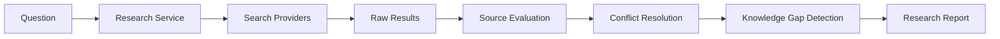

### Prediction Data Flow
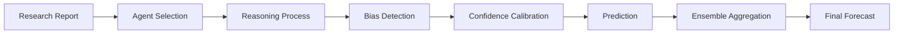

### Performance Feedback Loop
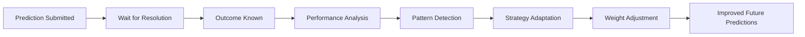

## 🔄 Error Handling & Recovery Flows

### Circuit Breaker Pattern
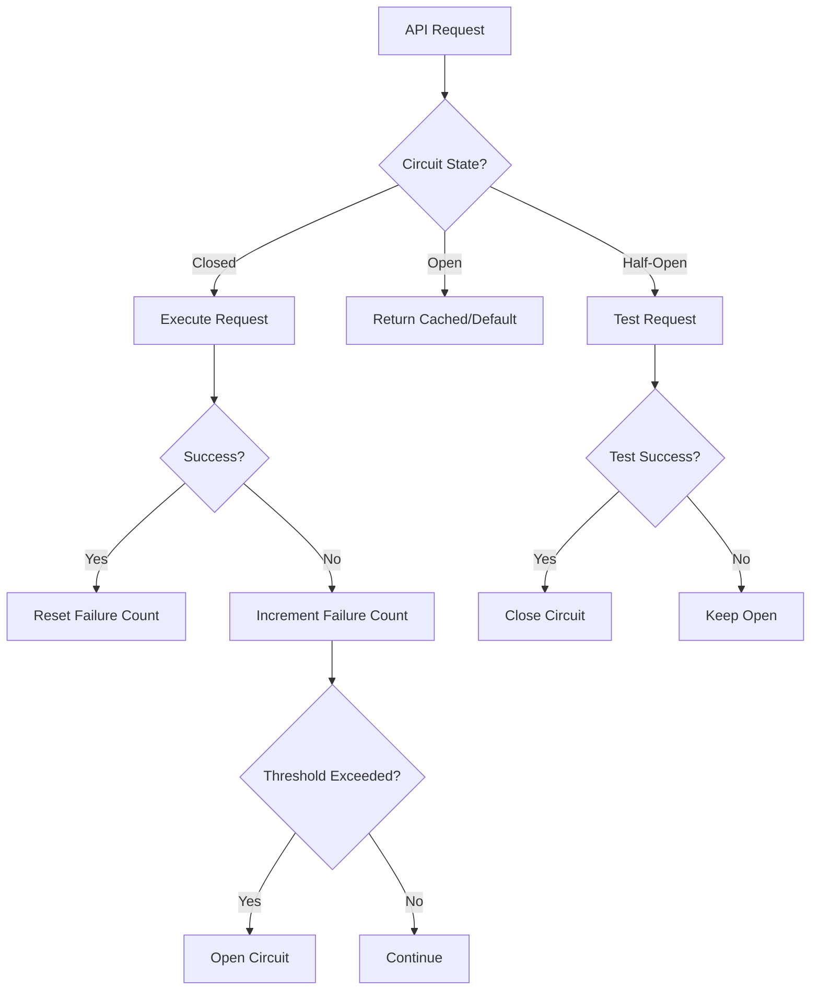

### Retry Strategy Flow
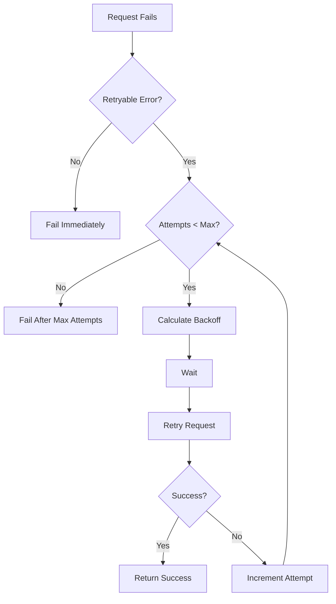

### Graceful Degradation Flow
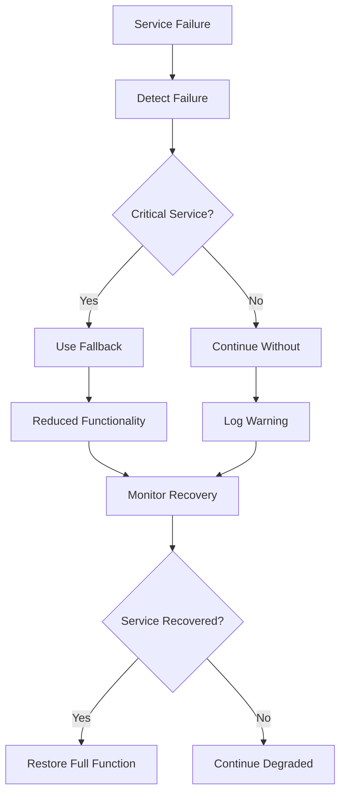

## 🚀 Deployment & Monitoring Flows

### Blue-Green Deployment Flow
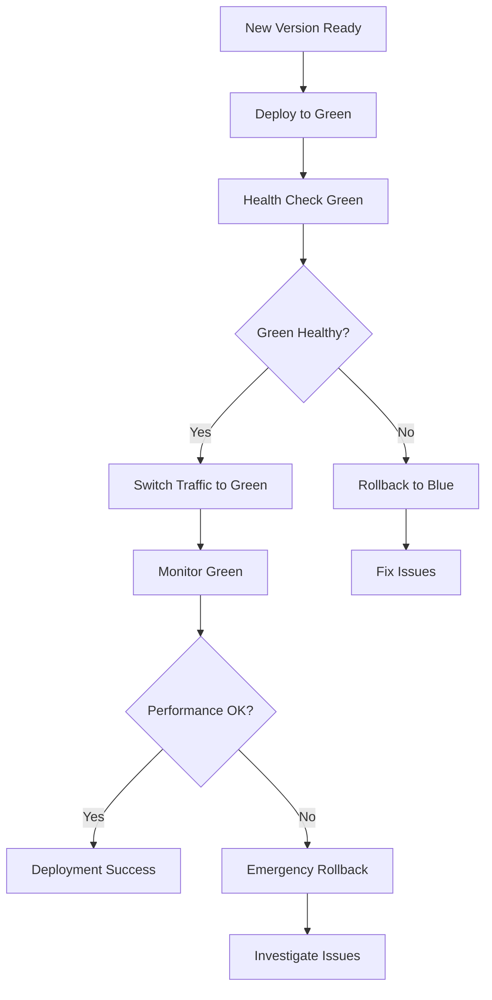

### Health Monitoring Flow
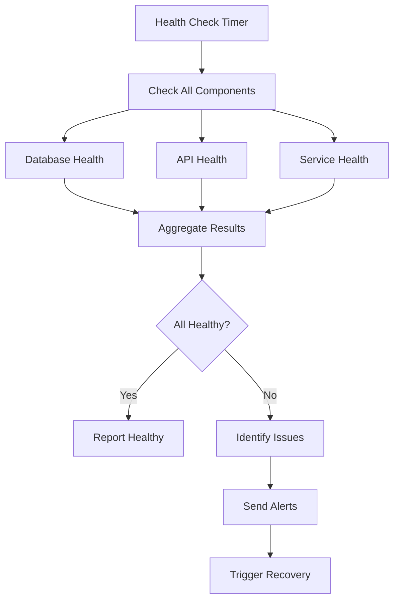

## 🎯 Tournament-Specific Flows

### Question Prioritization Flow
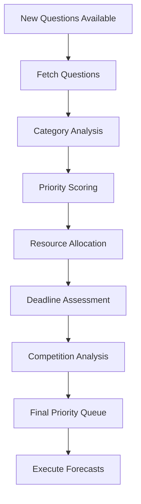

### Competitive Intelligence Flow
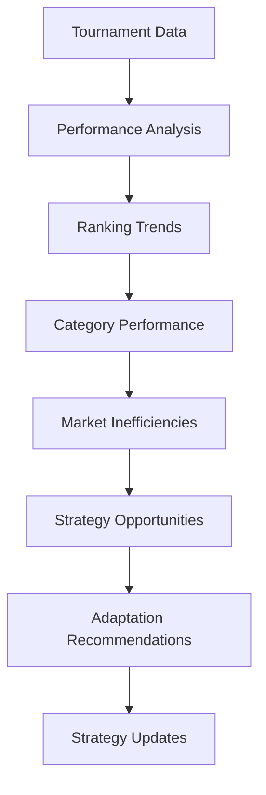

This comprehensive flow documentation provides the foundation for understanding how all components interact and depend on each other in the system.
